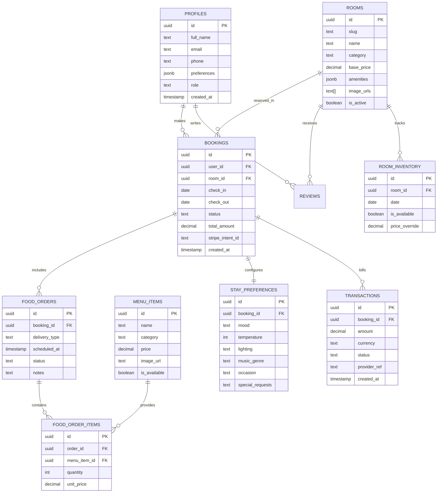

# LuxStay Nexus: Master Product Requirements Document (PRD)

## 1. Project Overview
**Product Name:** LuxStay Nexus  
**Code Name:** Project Ethereal  
**Version:** 2.0 (Master Edition)  
**Status:** Planning & Architectural Design  
**Target Launch:** Q3 2026

### 1.1 Executive Summary
LuxStay Nexus is a hyper-premium, emotionally intelligent hotel experience platform designed for high-end boutique hotels. It transforms the traditional booking transaction into a curated digital journey. By leveraging **Supabase** as the core engine (PostgreSQL, Auth, Realtime, Edge Functions) and **Next.js 15** for a high-fidelity frontend, the platform provides real-time personalization, integrated in-room dining, and an "Ambient Intelligence" suite that allows guests to control their room's physical environment before arrival.

---

## 2. Supabase Architectural Blueprint
LuxStay Nexus is "Supabase-Native," utilizing the full suite of services to ensure scalability, security, and real-time responsiveness.

### 2.1 Database (PostgreSQL)
*   **Master Schema Design:** A multi-tenant capable (for future expansion) schema with deep normalization and robust constraints.
*   **High-Volume Optimization:** 
    *   Use of **Database Indices** (B-tree for IDs, GIN for JSONB, GiST for date ranges) to ensure sub-100ms query times even with millions of rows.
    *   **Table Partitioning:** Bookings and Logs tables will be partitioned by year/month to maintain performance as data grows.
    *   **Foreign Key Constraints:** Strict cascading rules and ON DELETE actions to maintain data integrity.
*   **Extensions:** `uuid-ossp`, `pg_cron` (for automated maintenance), `postgis` (for location-based features), and `pg_net` (for async external requests).

### 2.2 Authentication & Authorization
*   **Supabase Auth:** Implementing PKCE flow for secure SSR authentication.
*   **Provider Suite:** Email/Password (magic links) + Google OAuth + Apple ID.
*   **Role-Based Access Control (RBAC):**
    *   Custom JWT claims to manage roles (`guest`, `staff`, `admin`, `super-admin`).
    *   Fine-grained **Row Level Security (RLS)** policies ensuring that a guest can only access *their* bookings, while staff can view *all* active stays.

### 2.3 Realtime & Edge Functions
*   **Realtime Subscriptions:** 
    *   **Admin Dashboard:** Live updates for new bookings, food orders, and check-ins.
    *   **Guest App:** Live room readiness status and food delivery tracking.
*   **Edge Functions (TypeScript):**
    *   `process-payment`: Securely handles Stripe webhooks and updates booking status.
    *   `send-notification`: Triggers Resend (Email) and Twilio (SMS) based on database events.
    *   `room-automation`: Integrates with IoT hubs to set room temperature/lighting based on guest preferences 30 minutes before check-in.

### 2.4 Storage & Assets
*   **Bucket Strategy:** 
    *   `public-assets`: Room photos, menu images, hotel gallery (CDN cached).
    *   `guest-documents`: Private storage for identity verification (highly restricted RLS).
*   **Image Transformation:** Utilizing Supabase's built-in image resizing to serve WebP variants based on device DPI.

---

## 3. Master Database Schema
The following schema is designed to handle extreme scale and complex relationship mapping.

### 3.1 Advanced SQL Implementation Details
*   **Atomic Availability Check:** A stored procedure `check_room_availability(room_id, start_date, end_date)` that uses a FOR UPDATE SKIP LOCKED lock to prevent double-booking during high concurrency.
*   **Materialized Views:** Used for the Admin Analytics dashboard to provide instant reports on Occupancy Rate and RevPAR (Revenue Per Available Room).
*   **Triggers:** 
    *   `on_booking_confirmed`: Automatically creates a `stay_preferences` record and triggers an email.
    *   `on_payment_success`: Updates `room_inventory` to mark dates as booked.

---

## 4. Master UX/UI Design Strategy

### 4.1 Visual Language: "The Ethereal Interface"
The UI must feel like a "digital concierge" — silent, helpful, and sophisticated.
*   **Glassmorphism 2.0:** Moving beyond simple blurs to "layered frosted glass" with dynamic light refraction based on scroll position.
*   **Micro-Interactions:** 
    *   **Haptic Flourishes:** Subtle vibrations on mobile for successful date selection or cart additions.
    *   **Progressive Disclosure:** Information is hidden until needed (e.g., room amenities only expand when a guest shows interest).
    *   **Liquid Transitions:** Using Framer Motion's layout animations to morph cards into full-screen views without "flashing."

### 4.2 Key Experience Pillars
1.  **The 4-Tap Booking:** A user should be able to book their frequent stay in just 4 taps using "Quick Book" logic derived from their profile preferences.
2.  **Sensory Personalization:** A dedicated "Atmosphere Wizard" that uses a circular dial (similar to a thermostat) to let guests set their room mood.
3.  **The "Live Receipt":** A real-time updating glass receipt that shows the cost breakdown including food and taxes as they add items.

### 4.3 Accessibility & Performance (Master Level)
*   **Performance:** 100/100 Lighthouse Score target. Use of Next.js PPR (Partial Prerendering) to show static content instantly while dynamic booking data loads.
*   **Accessibility:** Full WCAG 2.2 Level AAA compliance. High contrast modes that don't sacrifice the "luxury" feel.
*   **Offline First:** PWA capabilities allowing guests to view their digital room key and booking details even without an internet connection in the hotel elevators.

---

## 5. Core Feature Specifications

### 5.1 Smart Booking Engine
*   **Predictive Pricing:** Dynamic pricing based on occupancy levels (handled via Edge Functions).
*   **Waitlist Logic:** If a room is unavailable, a "Notify Me" feature that uses Supabase Realtime to alert the guest the second a cancellation occurs.

### 5.2 In-Room Dining Ecosystem
*   **Live Kitchen Tracking:** Guests see a progress bar: `Ordered` -> `Preparing` -> `In Transit` -> `Arrived`.
*   **Dietary Logic:** Menu items are filtered automatically based on the guest's profile (e.g., "Vegan," "Gluten-Free").

### 5.3 Atmosphere Control (IoT Bridge)
*   Pre-arrival room prep: 30 minutes before the `check_in_time`, the system sets the AC and lighting.
*   If the guest is delayed (tracked via optional "Arrival Estimate"), the system pauses energy consumption to be eco-friendly.

---

## 6. Security & Compliance
*   **Data Privacy:** Full GDPR/CCPA compliance. Guest data is encrypted at rest using AES-256.
*   **Payment Security:** PCI-DSS Level 1 compliance via Stripe. No credit card data ever touches the LuxStay servers.
*   **Audit Logs:** Every admin action (booking change, refund) is logged in a `system_logs` table for accountability.

---

## 7. Implementation Roadmap (High-Level)
1.  **Sprint 1:** Core Schema & Supabase Infrastructure.
2.  **Sprint 2:** Auth & Profile Management.
3.  **Sprint 3:** Booking Engine & Availability Logic.
4.  **Sprint 4:** Payment Integration & Transaction Management.
5.  **Sprint 5:** Food Ordering & Preference Engine.
6.  **Sprint 6:** Admin Dashboard & Realtime Analytics.
7.  **Sprint 7:** UX Polish, Animations, & Final QA.

---

## 8. Conclusion
The LuxStay Nexus Master PRD provides the definitive blueprint for a world-class hospitality platform. By combining the power of Supabase with a meticulous focus on UX, we are building more than a booking site — we are building the future of luxury travel.
